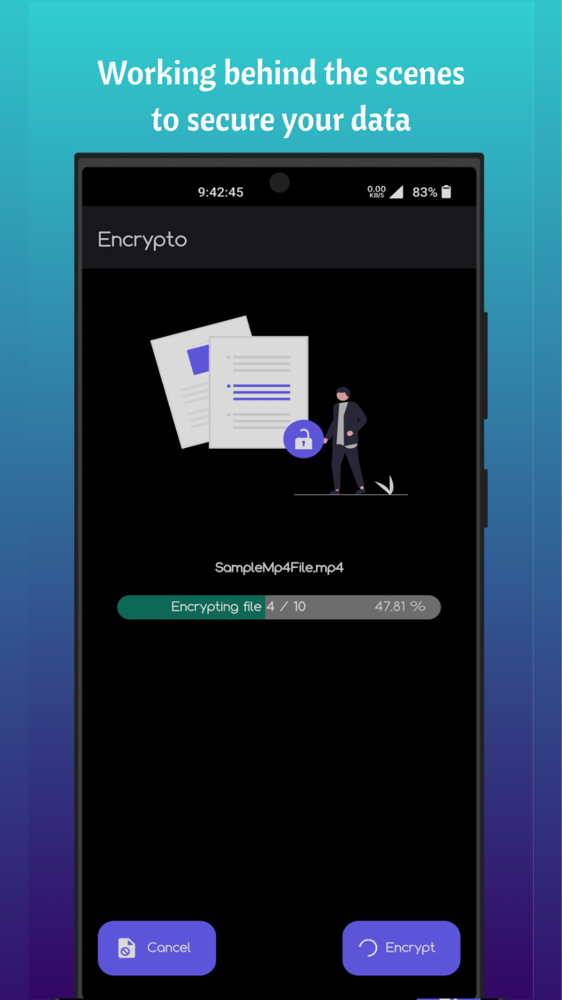
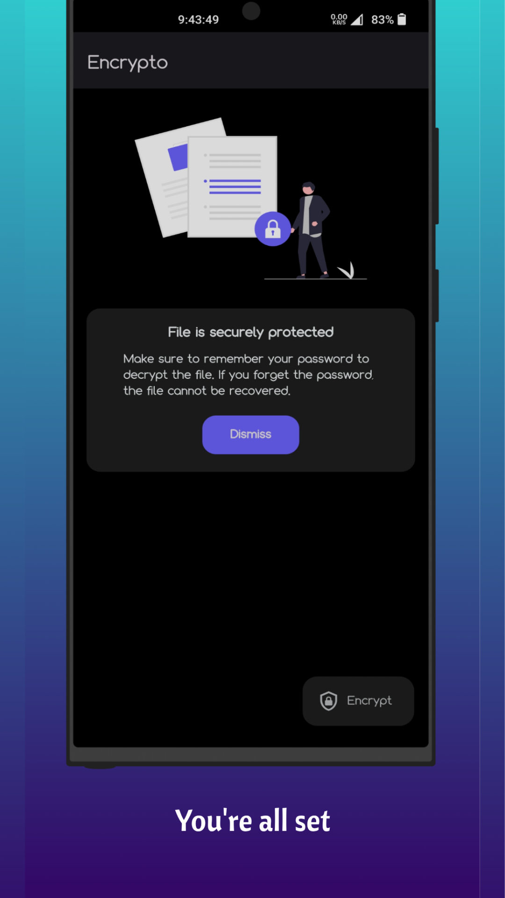

# 🔒📁 Encrypto: Your Trusted File Security App 📁🔒

 

   
   
   
   
   
  
  

  

Keep your files safe and secure with **Encrypto**! This user-friendly app is designed to protect your sensitive data by offering quick and reliable file encryption and decryption, ensuring that your files stay private and secure—all while operating completely offline.

## 🌟 Key Features of Encrypto 🌟

### 🔐 File Encryption & Decryption
- Easily encrypt and decrypt files of any type, from documents to images and more.
- State-of-the-art encryption using **AES-CBC** with advanced key management for unparalleled security.

### 📄 Supports All File Types
- Works seamlessly with any file type by reading them as base64, allowing flexible and comprehensive protection.

### 🚫 Completely Offline
- Your data stays on your device—no internet connection is required, giving you total control and privacy.

### 💪 Secure Technology
- Utilizes the power of **node-forge** for robust and effective encryption.
- Advanced algorithms, including **PKCS5 key derivation** and **AES-CBC ciphering**, ensure top-tier protection.

## 👥 Target Audience
Perfect for anyone looking to secure their files: individuals, businesses, or tech-savvy users wanting robust file safety.

## 🆓 Monetization & Accessibility
- **100% free to use**—no hidden charges, no premium features.
- Simple and minimalistic design for an easy-to-use experience.

## ⚙️ Customization & Usability
While currently minimal in customization, **Encrypto** is designed to be highly user-friendly. Select and encrypt/decrypt multiple files with just a few taps.

## 🚀 Future Updates
Exciting new features are on the horizon:
- **Encryption history logs** to track past operations.
- **File name masking** for added security and anonymity.

## ✨ Unique Selling Points
- Lightweight, fully offline, and completely secure.
- Minimalistic design with no unnecessary clutter.

## 💬 Feedback & Support
Your voice matters! Share your thoughts and feedback through the Play Store comments. Your input helps us make **Encrypto** even better.

## 🔒 Why Choose Encrypto?
**Encrypto** is built with a strong focus on simplicity, privacy, and security. Unlike other apps that rely on cloud services, Encrypto ensures your data stays local, providing peace of mind with every use.

**Take control of your data security with Encrypto—download it today and experience true file safety!**
