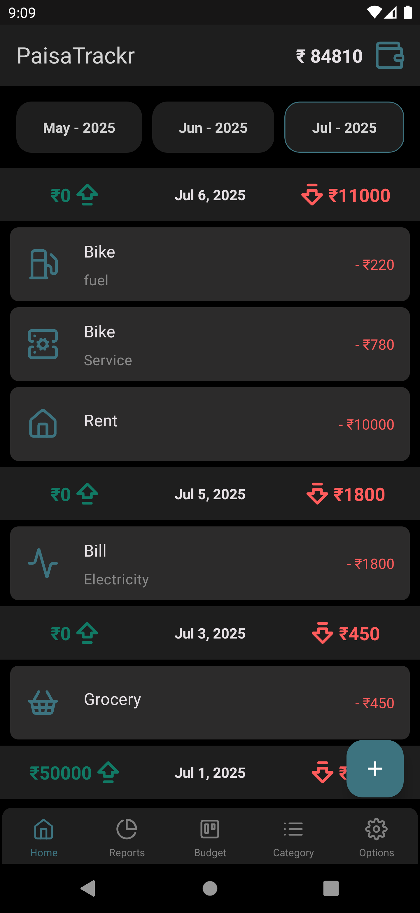
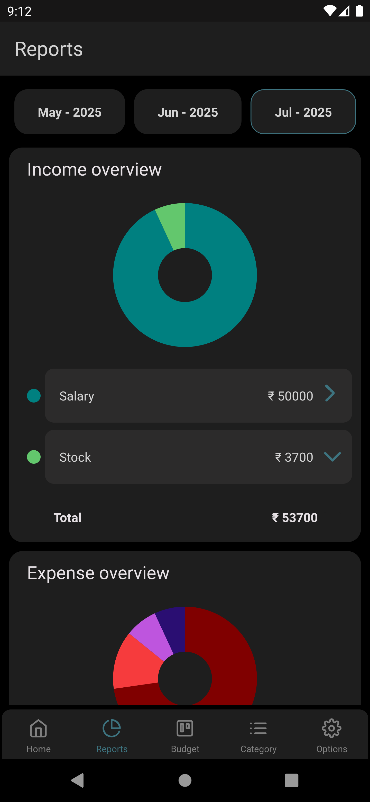
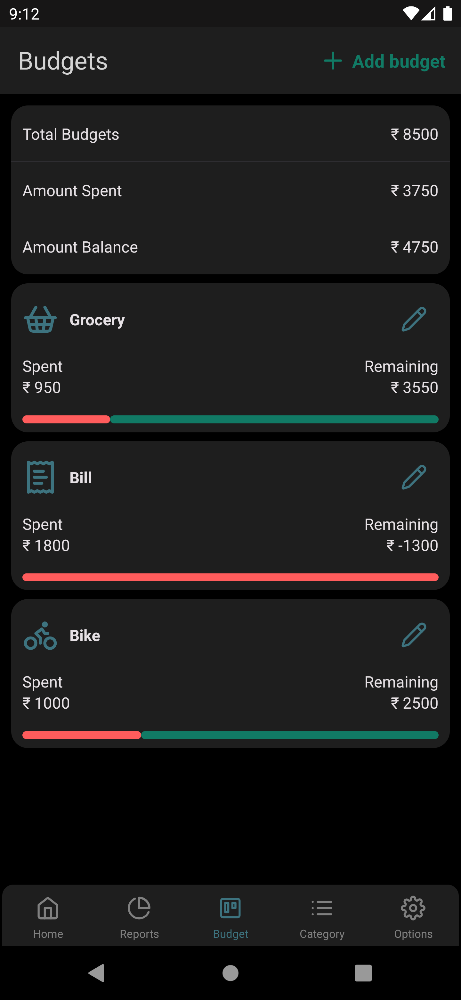
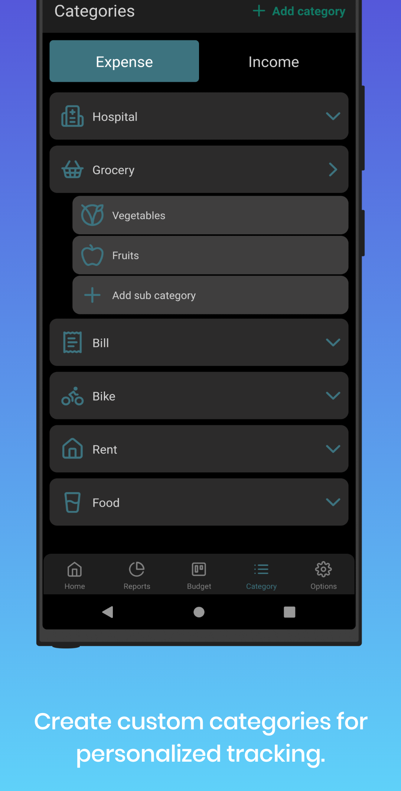
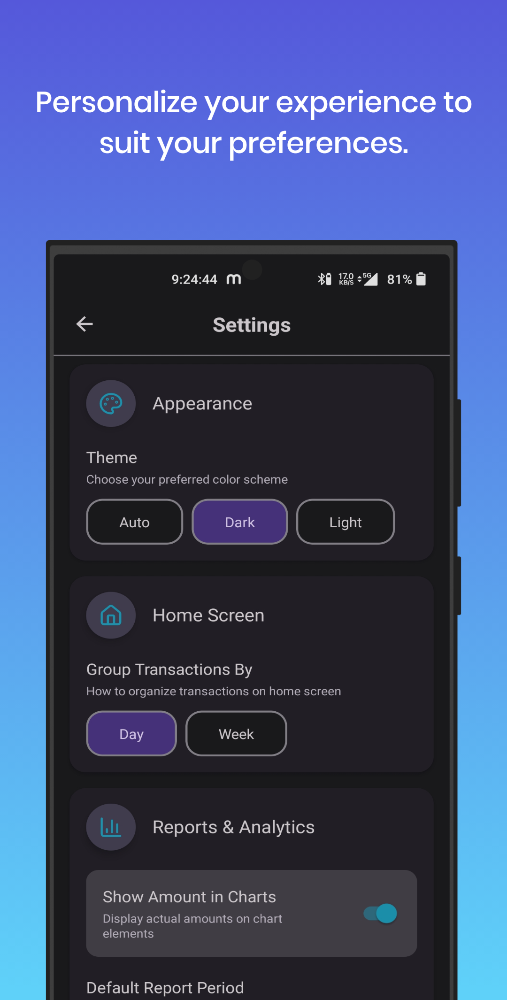

**📱💰 PaisaTrackr: Your Ultimate Finance Manager on the Go! 💰📱**

 

   
   
   
   
   

  

Stay in control of your finances with PaisaTrackr! This simple, intuitive finance app helps you track expenses, manage multiple accounts, and stick to your budget—all in one place. Perfect for anyone looking to streamline their finances effortlessly.

### 🌟 Key Features of PaisaTrackr🌟

**💼 Account Management**
   -  📂 **Create, Update, or Delete Accounts** effortlessly
   -  🔄 **Transfer Funds** between accounts with ease

**📈 Income & Expense Tracking**
- **Add, Update, or Delete Transactions** for both income and expenses
- 🔍 **Comprehensive Transaction Overview** with easy filtering and categorization

**💰 Budgeting Tools**
- 📅 **Create, Update, or Delete Budgets**, including recurring budget options
- 🚨 **Spending Alerts** for custom spending limits to keep you on track
- 📊 **Daily and Projected Spending Summaries**
- 📈 **Line Chart View** of spending patterns for each budget category

**📂 Categories & Subcategories**
- 🖌️ **Create, Update, or Delete Categories** and assign subcategories for better organization
- 🏷️ **Icon Support** for each category to make tracking easy

**📊 In-Depth Reports**
- 🔍 **Comprehensive Income & Expense Overviews** with visually appealing graphs
- 📅 **Custom Date Range Reports** for in-depth insights
- 📆 **Month-by-Month Reports** to track trends over time

**⚙️ Customization & Settings**
- 🌙 **Color Themes**: Choose from dark, light, or system theme
- 📅 **Transaction Grouping** by day or week for easy viewing
- 📅 **Report Views** by selected date range or monthly breakdowns

### 🎯 Target Audience 🎯  
- Perfect for anyone interested in tracking their financial activities—whether budgeting, managing multiple accounts, or simply organizing expenses.

### 💡 Unique Selling Points 💡  
- ✅ **Minimalistic and User-Friendly Design**  
- ✅ **Multiple Account Management**  
- ✅ **Budget Control Across All Accounts**

### 🌍 Usability  
- **Currency-Free Design** to accommodate various user preferences

### 🆓 Free to Use – No Premium Features or In-App Purchases! 

### 🌐 Offline Mode with Planned Updates for Cloud Sync and Multi-Device Access  

Take charge of your finances with PaisaTrackr today!

