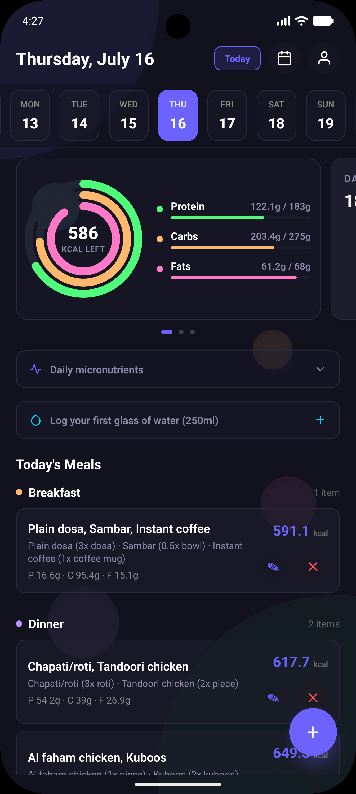
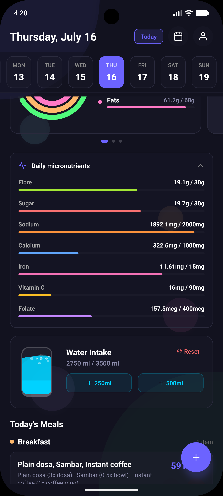
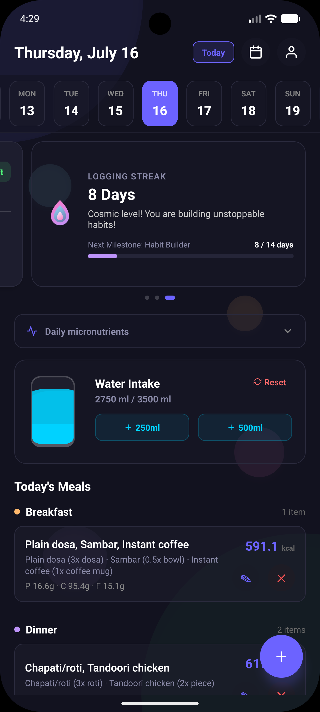
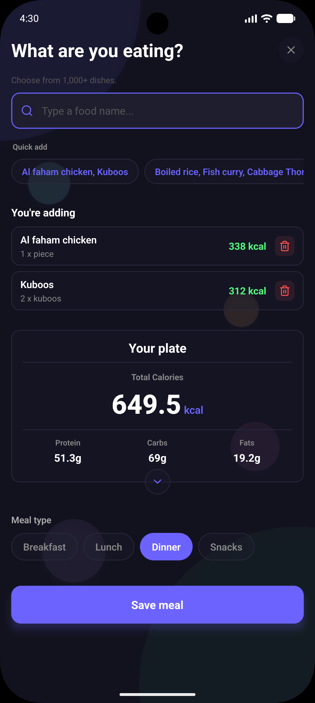
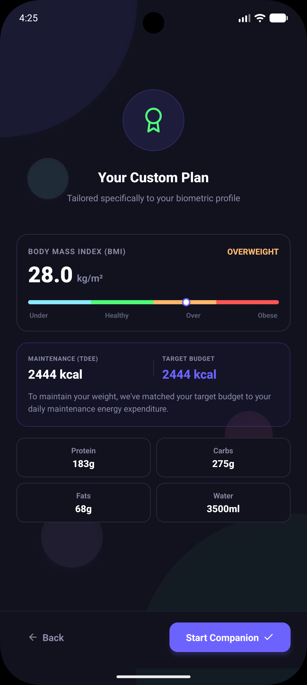

**📱🥗 Zling: Your Calorie & Nutrition Companion! 🥗📱**

 

   
   
   
   
   

  

Keep your diet on track with Zling! This sleek, premium calorie and nutrition tracker helps you plan your daily calorie budget, monitor your macros (protein, carbs, fats), track essential micronutrients, and maintain streaks—all in one gorgeous, user-friendly interface. Designed to make healthy living intuitive and engaging.

### 🌟 Key Features of Zling 🌟

**🥗 Calorie & Macro Tracking**
- 📊 **Dynamic Daily Calorie Budget** based on your personal health goals (lose, maintain, or gain weight)
- ⚡ **Macronutrient Splits**: Monitor Protein, Carbs, and Fats intake in real-time
- 💧 **Water Intake Tracker**: Log your hydration targets throughout the day

**📈 Indian Food Database & Servings**
- 🔍 **Search 1,000+ Indian Foods** with precise portion details
- 🥄 **Accurate Servings**: Choose weights or counts (`tbsp`, `dessert cup`, `slice/piece`, `bowl`, `scoop`)
- ⚡ **Quick Add Suggestions**: Easily add frequent meals, sorted automatically by frequency and recency

**🔥 Habit & Streaks Tracker**
- 📅 **Streak Flame Component**: Track consecutive days under your calorie budget
- 🏆 **Interactive streak visuals** to keep you motivated towards your goal

**🚀 Personalized Onboarding**
- 🛠️ **Custom Plan Generator**: Interactive screens assessing biometrics (weight, height, age, activity level)
- 🌀 **Premium Reanimated Loader**: Beautiful loading indicator displaying dynamic calculation details

**📊 Daily Micronutrient Breakdown**
- 🔍 **Sub-nutrient Monitoring**: Detailed views for specific health goals and micro targets

### 🎯 Target Audience 🎯  
- Perfect for individuals tracking their dietary habits, monitoring macro targets, seeking structured calorie counts, or managing weight goals.

### 💡 Unique Selling Points 💡  
- ✅ **Premium Dark-themed Glassmorphism Aesthetics**  
- ✅ **Tailored Database for Indian Diet Options**  
- ✅ **Smart Quick-Add Mechanics**
